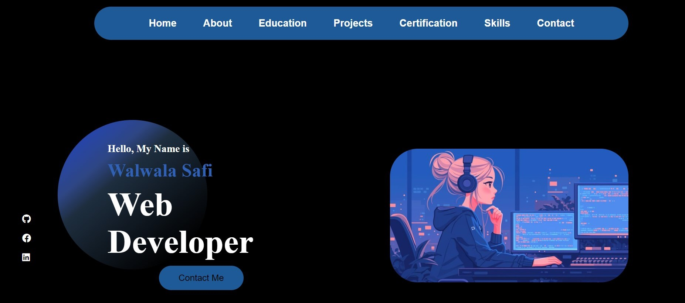

Walwala Safi's Portfolio

Demo 📸

Welcome to Walwala Safi's portfolio! I am a passionate and dedicated web developer with expertise in crafting visually engaging and highly functional websites. My portfolio showcases a range of projects that demonstrate my proficiency in HTML, CSS, JavaScript, and responsive design.

Projects Highlight:

◻ Palindrome Checker: An intuitive web application that checks if a given text is a palindrome, with a focus on clean design and usability.

◻ Survey Form: A straightforward student survey form with fields for various data, featuring clear and effective styling.

◻ Roman Number Converter: A tool for converting Arabic numbers to Roman numerals, designed with a user-friendly interface for accurate conversions.

Explore my work to see how I combine technical skills with creative design to build effective web solutions. Feel free to reach out if you have any questions or opportunities for collaboration.

Dimo link: (https://walwalasafi.github.io/Portfolio/)

Technologies Used 🛠️

🔹HTML

🔹CSS

🔹java script

Contribution

◻ Hadisa Zahirzai.

◻ Zabeena Sherzoie.

◻ Safia Iqbal.

Contributing

We welcome contributions to improve the Roman Number Converter. If you have ideas for enhancements, notice any issues, or want to work on this project, please follow these steps:

Fork the repository.
Create a new branch: git checkout -b feature-name
Make your changes and commit them: git commit -m "Description of changes"
Push to the branch: git push origin feature-name
Create a pull request

Rquirements# 

1️⃣creat a new repository in your github

2️⃣Create a New Project Directory:

Open your terminal or command prompt. Navigate to the directory where you want to create your project. Run the following command to create a new directory for your project: bash Copy code mkdir documentation-project

3️⃣open HTML in any program such you want ssuch us: vscode, terminal and cmd.

4️⃣creat a  HTML file.

4️⃣creat a  javascript file.

5️⃣give a style to project by creating style.css file. 

6️⃣ use (git add, git commint, git push) in the git bash to push it in Github.

7️⃣Make a string and uniqe project-Readme.md file.

Author 🔵✅
◻ Github: WALWALA SAFI (https://github.com/WALWALASAFI/product-landing-page.git)

◻ Linkedin:  walwala safi (https://www.linkedin.com/in/walwala-safi-65b56530a/)

◻ Email: walwala safi (walwalasafi99@gmail.com)

